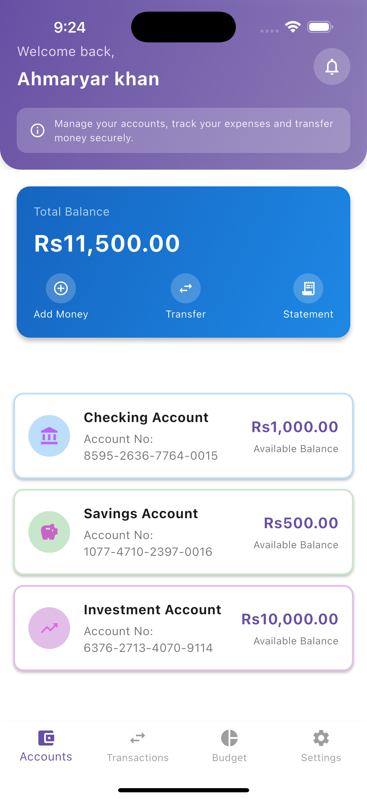
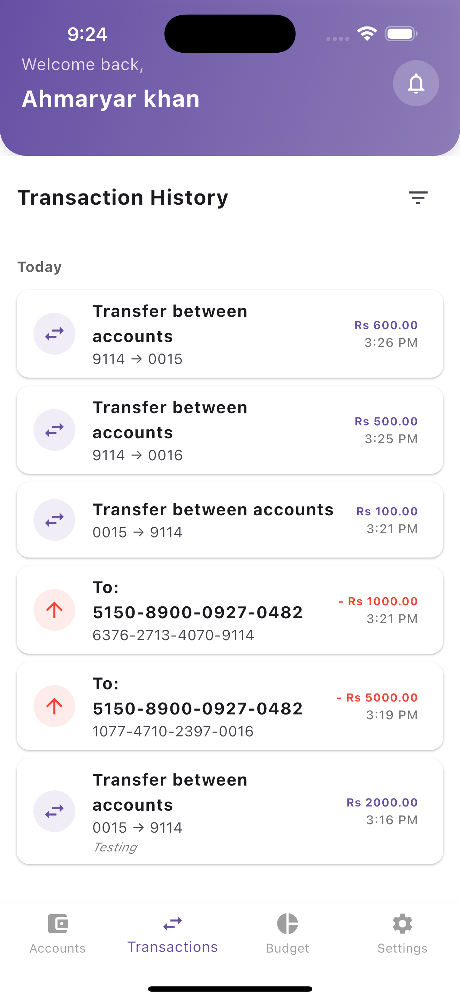
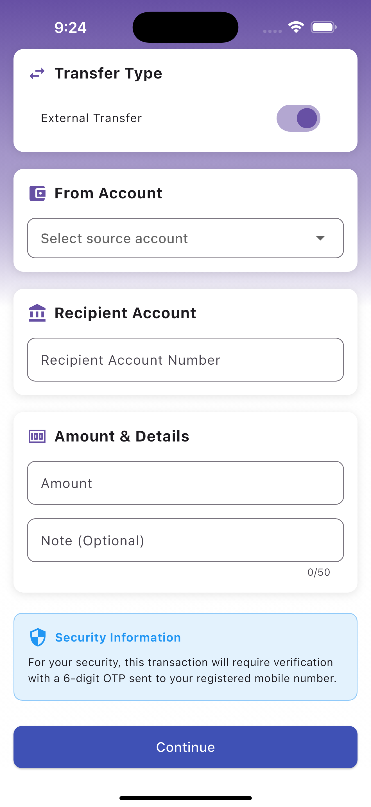
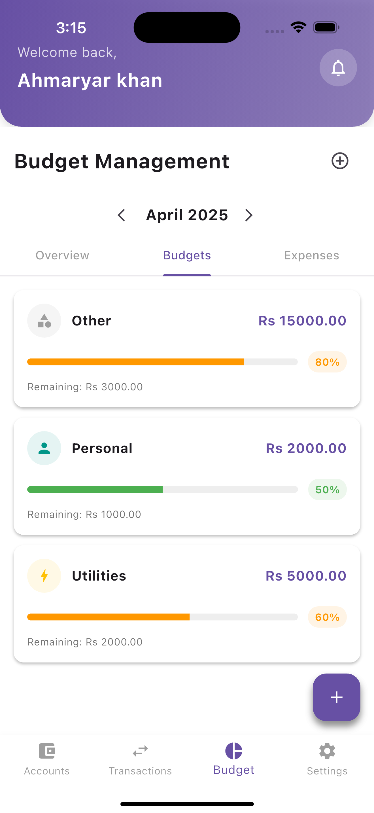
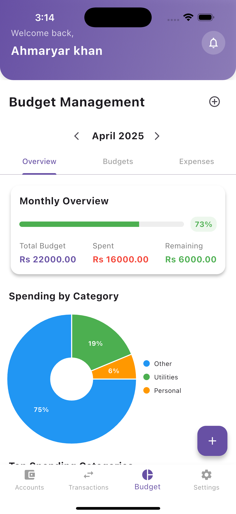
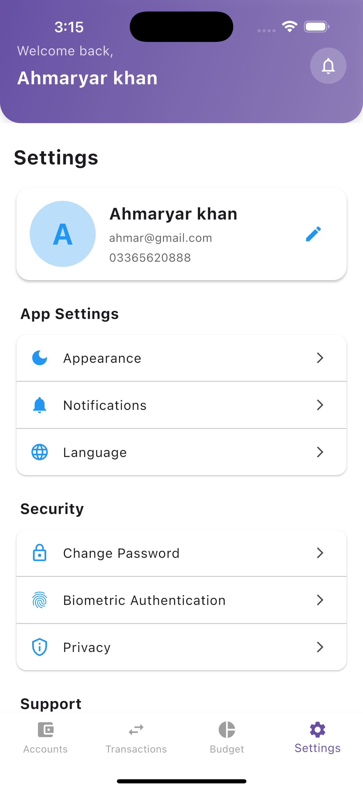

# Banking App with Firebase

A secure banking application built with Flutter and Firebase, featuring money transfers, budget management, and expense tracking.

## Features

- **Secure User Authentication**: Email/password sign-up and login with Firebase Authentication
- **Two-Factor Authentication**: OTP verification for secure transactions
- **Account Management**: Create and manage multiple account types (Savings, Checking, Investment)
- **Money Transfers**: Transfer money between accounts with real-time updates
- **Budget Management**: Create and track budgets by category
- **Expense Tracking**: Log and monitor expenses by category
- **Transaction History**: View detailed transaction history for each account
- **Real-time Data**: Firestore integration for real-time data updates

## Firebase Integration

This app uses Firebase for several key features:

- **Firebase Authentication**: Secure user authentication
- **Cloud Firestore**: Real-time database for accounts, transactions, budgets, and expenses
- **Firebase Storage** (optional): Store user profile images
- **Cloud Functions** (optional): Server-side logic for secure transactions

## Project Structure

- **lib/models/**: Data models for users, accounts, transactions, etc.
- **lib/providers/**: State management with Provider
- **lib/screens/**: UI screens for the app
- **lib/utils/**: Firebase services and utility classes
- **lib/widgets/**: Reusable UI components

## Key Components

### Firebase Services

- **FirebaseAuthService**: Handles user authentication and OTP verification
- **FirestoreService**: Manages Firestore database operations
- **AccountService**: Manages banking accounts
- **TransactionService**: Handles money transfers between accounts

### Security Features

- **Two-Factor Authentication**: OTP verification for sensitive operations
- **Data Validation**: Server-side and client-side validation
- **Batch Operations**: Atomic transactions for money transfers
- **Secure Routing**: Authentication-based navigation

## Getting Started

To run this app:

1. Firebase is already set up using FlutterFire CLI
2. Run `flutter pub get` to install dependencies
3. Run `flutter run` to start the app

## Database Schema

### Users Collection

```
users/{userId}
  - name: String
  - email: String
  - phoneNumber: String
  - profileImageUrl: String
  - createdAt: Timestamp
```

### Accounts Collection

```
accounts/{accountId}
  - userId: String
  - accountNumber: String
  - balance: Double
  - type: String (Savings, Checking, Investment)
  - createdAt: Timestamp
```

### Transactions Collection

```
transactions/{transactionId}
  - fromAccountId: String
  - toAccountId: String
  - amount: Double
  - timestamp: Long
  - note: String
  - type: String (transfer, deposit, withdrawal)
  - status: String (pending, completed, failed)
  - externalAccountNumber: String (optional)
  - createdAt: Timestamp
```

### Budgets Collection

```
budgets/{budgetId}
  - userId: String
  - category: String
  - amount: Double
  - month: Integer
  - year: Integer
  - createdAt: Timestamp
```

### Expenses Collection

```
expenses/{expenseId}
  - userId: String
  - category: String
  - amount: Double
  - description: String
  - date: Long
  - createdAt: Timestamp
```

### OTPs Collection

```
otps/{userId}
  - otp: String
  - expiresAt: Long
  - createdAt: Timestamp
```

## Migration from SQLite

This app has been migrated from SQLite to Firebase to enable:

1. **Real-time data synchronization**
2. **User-to-user transfers**
3. **Cloud backup of all data**
4. **Secure authentication**
5. **Scalability for larger user base**

The migration involved:

- Converting database operations to Firestore queries
- Implementing Firebase Authentication
- Adding real-time listeners for data updates
- Creating security rules for data access
- Adding two-factor authentication with OTP


## Screenshots

Here are some screenshots of the application:

| Dashboard                                          | Transaction History                            | Transfer Money                                         |
| -------------------------------------------------- | ---------------------------------------------- | -------------------------------------------- |
|  |  |  |

| Budget Management                                        | Account Overview                                        | Settings                                        |
| ---------------------------------------------------- | ----------------------------------------------------- | ----------------------------------------------- |
|  |  |  |

## Future Enhancements

- Push notifications for transactions
- Biometric authentication
- Financial insights and analytics
- Bill payments and scheduled transfers
- Investment portfolio management
